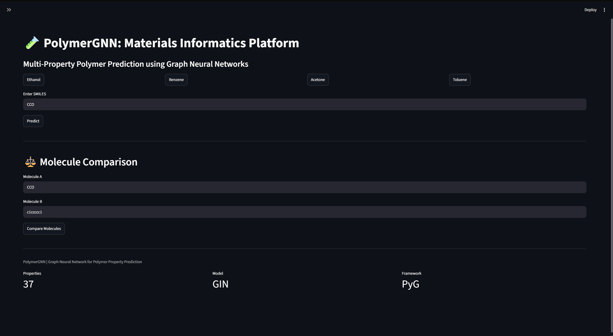
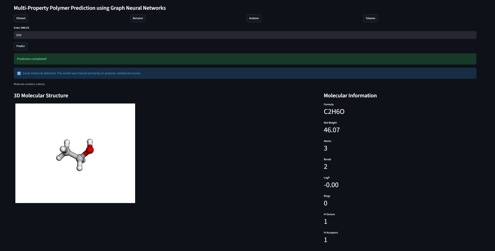
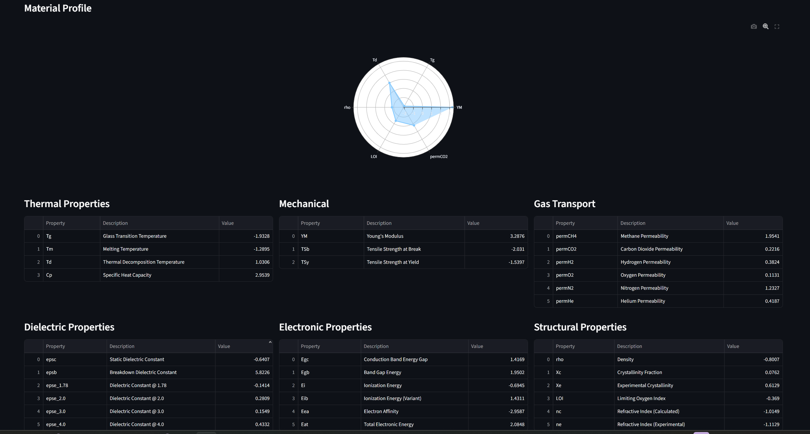
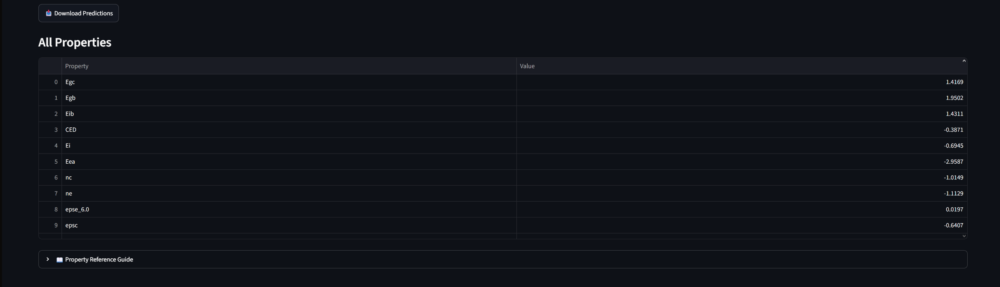
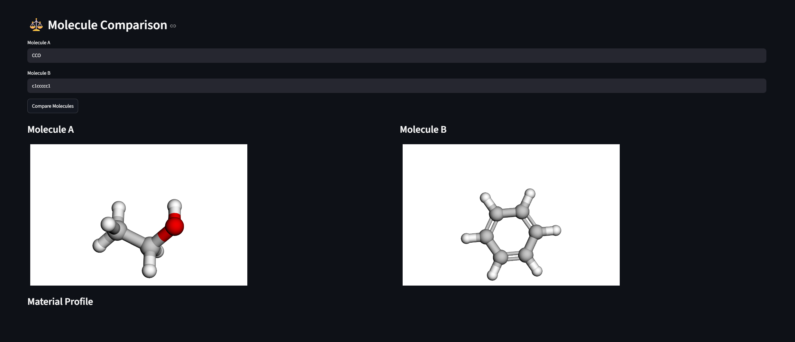
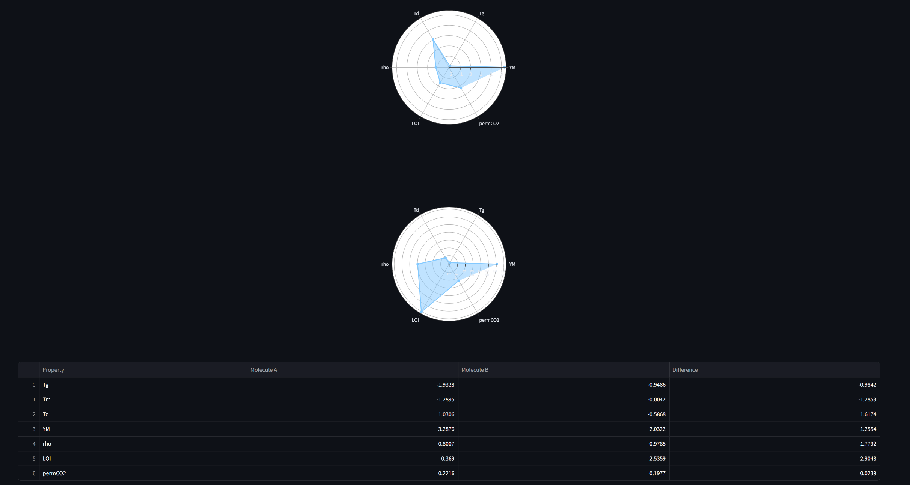

# 🧪 PolymerGNN: Multi-Property Polymer Prediction Platform

### 🚀 Live Demo

**Try the application here:**  
https://polymergnn-28hntqgucsqwgdo8dcjvos.streamlit.app/



Graph Neural Network for Multi-Property Polymer Prediction and Materials Informatics.

## 📸 Application Screenshots

### Main Dashboard

The primary prediction interface featuring molecular visualization, molecular descriptors, categorized property prediction, and interactive analytics.


---

## 🔬 Single Molecule Prediction

### Molecular Visualization & Property Prediction

Interactive 3D molecular rendering alongside molecular information and predicted material properties.



### Categorized Property Analysis

Thermal, mechanical, gas transport, dielectric, electronic, and structural property predictions.



### Radar Chart Material Profile

Visual comparison of key predicted material characteristics.



---

## ⚖️ Molecule Comparison Mode

### Side-by-Side Molecular Analysis

Compare two molecular structures and evaluate their predicted properties.



### Comparative Property Screening

Radar-chart-based comparison and property benchmarking for material selection.



```
```


## Overview

PolymerGNN is a Graph Neural Network (GNN)-based materials informatics platform designed to predict multiple polymer properties directly from molecular structures represented as SMILES strings.

The project leverages a Graph Isomorphism Network (GIN) architecture implemented using PyTorch Geometric to learn structure-property relationships from polymer data. Molecules are converted into graph representations where atoms are nodes and chemical bonds are edges, allowing the model to capture complex molecular interactions that influence material performance.

The trained model predicts 37 polymer properties spanning thermal, mechanical, dielectric, electronic, structural, and gas transport domains. An interactive Streamlit dashboard enables molecular visualization, property prediction, comparative analysis, and result export.

---

## Key Features

### Molecular Analysis

* SMILES-based molecular input
* RDKit-powered molecular processing
* Automatic molecular descriptor extraction
* Interactive 3D molecular visualization using Py3Dmol

### Deep Learning Model

* Graph Isomorphism Network (GIN)
* Multi-task learning architecture
* 37 simultaneous property predictions
* PyTorch Geometric implementation
* GPU acceleration using CUDA

### Property Prediction Categories

#### Thermal Properties

* Glass Transition Temperature (Tg)
* Melting Temperature (Tm)
* Thermal Decomposition Temperature (Td)
* Heat Capacity (Cp)

#### Mechanical Properties

* Young's Modulus (YM)
* Tensile Strength at Break (TSb)
* Tensile Strength at Yield (TSy)

#### Gas Transport Properties

* Methane Permeability
* Carbon Dioxide Permeability
* Hydrogen Permeability
* Oxygen Permeability
* Nitrogen Permeability
* Helium Permeability

#### Dielectric Properties

* Static Dielectric Constant
* Breakdown Dielectric Constant
* Frequency-dependent Dielectric Constants

#### Electronic Properties

* Band Gap Energy
* Ionization Energy
* Electron Affinity
* Electronic Energy Metrics

#### Structural Properties

* Density
* Crystallinity Metrics
* Limiting Oxygen Index
* Refractive Index Metrics

---

## Deep Learning Architecture

### Graph Construction

Each molecule is converted into a graph representation:

* Nodes → Atoms
* Edges → Chemical Bonds

Atom features include:

* Atomic Number
* Degree
* Valence
* Aromaticity

Bond features include:

* Bond Type
* Conjugation Information
* Ring Membership

### Model Pipeline

SMILES String

↓

RDKit Molecular Graph

↓

Graph Isomorphism Network (GIN)

↓

Message Passing Layers

↓

Global Add Pooling

↓

Graph-Level Embedding

↓

37 Regression Heads

↓

Property Predictions

### Architecture Details

* GINConv Layers: 3
* Hidden Dimension: 128
* Batch Normalization
* ReLU Activations
* Dropout Regularization
* Global Add Pooling
* Multi-Task Regression Heads

---

## Training Strategy

### Data Processing

* Molecular graph generation using RDKit
* Feature extraction for atoms and bonds
* Z-score normalization of target properties

### Optimization

* Loss Function: Mean Squared Error (MSE)
* Optimizer: Adam
* Learning Rate Scheduling: ReduceLROnPlateau
* Early Stopping
* Weight Decay Regularization

### Evaluation Metrics

* Mean Absolute Error (MAE)
* Root Mean Squared Error (RMSE)
* R² Score

---

## Interactive Dashboard

The Streamlit application provides:

### Single Molecule Prediction

* Property prediction for individual molecules
* Interactive 3D molecular visualization
* Categorized property display
* Radar chart visualization
* CSV export functionality

### Molecule Comparison Mode

* Side-by-side molecular analysis
* Comparative property prediction
* Dual radar chart visualization
* Material screening and evaluation

### Property Reference System

* Human-readable property descriptions
* Categorized property organization
* Scientific interpretation support

---

## Technology Stack

### Deep Learning

* PyTorch
* PyTorch Geometric

### Cheminformatics

* RDKit

### Data Science

* NumPy
* Pandas
* Scikit-learn

### Visualization

* Plotly
* Py3Dmol

### Deployment

* Streamlit

---

## Installation

```bash
git clone https://github.com/YOUR_USERNAME/PolymerGNN.git

cd PolymerGNN

pip install -r requirements.txt
```

Run the application:

```bash
streamlit run app.py
```

---

## Example Workflow

1. Enter a molecular SMILES string
2. Generate a molecular graph representation
3. Visualize the molecule in 3D
4. Predict 37 polymer properties
5. Analyze results through categorized property tables
6. Compare candidate materials using comparison mode
7. Export results for further analysis

---

## Future Work

* Polymer recommendation engine
* Dataset percentile ranking
* Uncertainty estimation
* Explainable AI for property prediction
* Additional polymer datasets
* Cloud deployment
* Polymer generation and inverse design

---

## Author

Shriram

Graph Neural Networks • Materials Informatics • Quantum Machine Learning • Polymer Property Prediction
